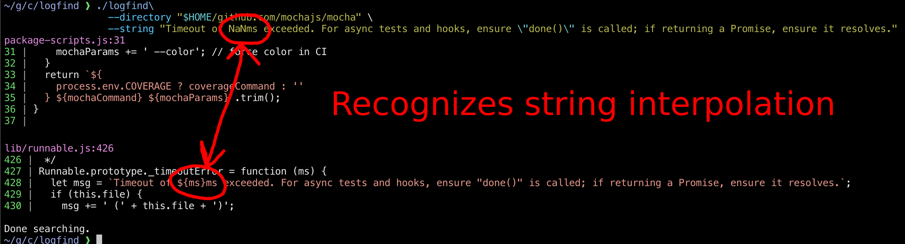

# Logfind: find where log messages come from in source code

Logfind takes a log or error message and a directory to search in, and prints out all the strings and template strings that could emit that message:

```
$ logfind \
  --directory "$HOME/github.com/mochajs/mocha" \
  --string "Timeout of NaNms exceeded. For async tests and hooks, ensure \"done()\" is called; if returning a Promise, ensure it resolves."
```



## Features

- Works on JS (TODO support other languages)
- Highlights hits (TODO add syntax highlighting)
- Streams results as they're found (TODO make it faster by indexing)
- Finds results by full message (TODO also find partial messages and rank them)

## Installation

```
$ ./build
$ file built/logfind
built/logfind: Mach-O 64-bit executable arm64
```
